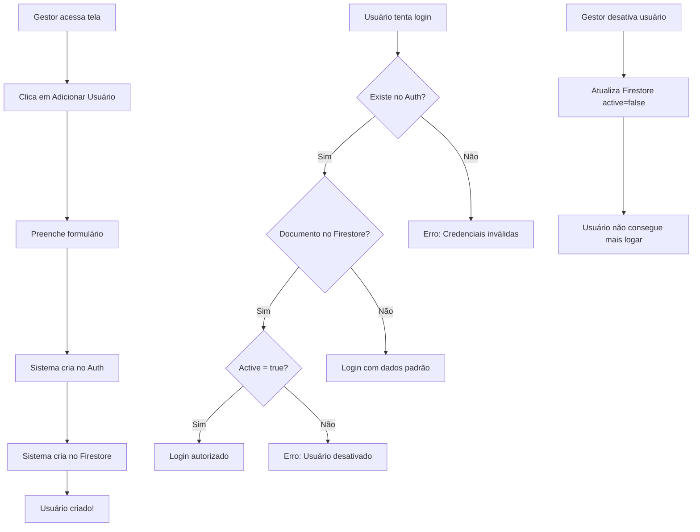

# 👥 Gerenciamento de Usuários - Firebase

## 📋 Visão Geral

O sistema de gerenciamento de usuários integra **Firebase Authentication** e **Firestore** para criar, listar e desativar usuários diretamente pela interface do sistema.

## 🔐 Funcionalidades

### ✅ Apenas Gestores Podem:
- ✨ Criar novos usuários
- 📝 Definir perfil (Gestor ou Colaborador)
- 🔴 Desativar acessos
- 🟢 Reativar usuários desativados
- 👀 Visualizar lista completa de usuários

### 🏗️ Estrutura de Dados

#### Firebase Authentication
```
Email: usuario@gestao-estoque.local
Password: [senha definida]
DisplayName: [nome completo]
```

#### Firestore - Coleção `users`
```javascript
{
  name: "Nome Completo",
  username: "usuario",
  role: "GESTOR" | "COLABORADOR",
  active: true | false,
  createdAt: Timestamp,
  updatedAt: Timestamp
}
```

## 🚀 Como Funciona

### 1️⃣ **Criação de Usuário**

Quando o gestor cria um usuário no sistema:

```typescript
// 1. Cria no Firebase Authentication
const userCredential = await createUserWithEmailAndPassword(
  auth, 
  `${username}@gestao-estoque.local`, 
  password
);

// 2. Atualiza o nome no perfil
await updateProfile(userCredential.user, {
  displayName: nome
});

// 3. Cria documento no Firestore
await setDoc(doc(db, 'users', userCredential.user.uid), {
  name: nome,
  username: username,
  role: perfil,
  active: true,
  createdAt: Timestamp.now()
});
```

**Resultado:** 
- ✅ Usuário criado no Authentication
- ✅ Documento criado no Firestore
- ✅ Pronto para fazer login

### 2️⃣ **Login de Usuário**

No login, o sistema:

1. **Autentica** no Firebase Auth
2. **Busca dados** no Firestore
3. **Valida status** (ativo/desativado)
4. **Retorna dados** do usuário

```typescript
// Verificação de status
if (userData.active === false) {
  await firebaseSignOut(auth);
  throw new Error('Usuário desativado');
}
```

### 3️⃣ **Desativação de Usuário**

Quando o gestor desativa um usuário:

```typescript
await updateDoc(doc(db, 'users', userId), {
  active: false,
  updatedAt: Timestamp.now()
});
```

**Resultado:**
- ❌ Usuário **NÃO** consegue fazer login
- 🔒 Mensagem: "Usuário desativado. Entre em contato com o administrador."
- 📊 Permanece no Authentication (não é deletado)
- 📝 Status visível na tabela

### 4️⃣ **Reativação de Usuário**

Para reativar:

```typescript
await updateDoc(doc(db, 'users', userId), {
  active: true,
  updatedAt: Timestamp.now()
});
```

**Resultado:**
- ✅ Usuário pode fazer login novamente
- 🟢 Status alterado para "Ativo"

## 🎨 Interface

### Tela de Gerenciamento

```
┌─────────────────────────────────────────────────────┐
│ Gerenciamento de Usuários    [+ Adicionar Usuário] │
├─────────────────────────────────────────────────────┤
│ Nome          │ Usuário │ Perfil   │ Status │ Ações│
├─────────────────────────────────────────────────────┤
│ João Silva    │ joao    │ GESTOR   │ 🟢 Ativo│ [Desativar]│
│ Maria Santos  │ maria   │ COLABORADOR│🟢 Ativo│ [Desativar]│
│ Pedro Costa   │ pedro   │ COLABORADOR│🔴 Desativado│ [Ativar]│
└─────────────────────────────────────────────────────┘
```

### Modal de Criação

```
┌──────────────────────────────┐
│ Adicionar Novo Usuário       │
├──────────────────────────────┤
│ Nome Completo: [____________]│
│ Nome de Usuário: [_________] │
│ Senha: [___________________] │
│ Perfil: [Colaborador ▼]      │
│                              │
│        [Cancelar] [Salvar]   │
└──────────────────────────────┘
```

## ⚙️ Configuração do Firebase

### 1. Firebase Console - Authentication

```
1. Acesse: https://console.firebase.google.com
2. Selecione o projeto: gestao-estoque-f4b01
3. Authentication → Sign-in method
4. Ative: Email/Password ✅
```

### 2. Firestore Rules

Configure as regras de segurança:

```javascript
rules_version = '2';
service cloud.firestore {
  match /databases/{database}/documents {
    
    // Usuários autenticados podem ler/escrever
    match /items/{document=**} {
      allow read, write: if request.auth != null;
    }
    
    match /movements/{document=**} {
      allow read, write: if request.auth != null;
    }
    
    // Apenas gestores podem gerenciar usuários
    match /users/{userId} {
      allow read: if request.auth != null;
      allow write: if request.auth != null && 
                     get(/databases/$(database)/documents/users/$(request.auth.uid)).data.role == 'GESTOR';
    }
  }
}
```

### 3. Criar Primeiro Usuário Gestor (Manualmente)

**Via Firebase Console:**

```
1. Authentication → Users → Add user
   Email: gestor@gestao-estoque.local
   Password: sua-senha-segura

2. Copie o UID do usuário criado

3. Firestore Database → Start collection
   Collection ID: users
   Document ID: [cole o UID]
   
   Campos:
   - name: "Admin Gestor"
   - username: "gestor"
   - role: "GESTOR"
   - active: true
   - createdAt: [timestamp atual]
   - updatedAt: [timestamp atual]
```

**Ou via código (uma única vez):**

Rode este código no console do navegador (após login como gestor):

```javascript
import { doc, setDoc, Timestamp } from 'firebase/firestore';
import { auth, db } from './services/firebase';

const currentUser = auth.currentUser;
if (currentUser) {
  await setDoc(doc(db, 'users', currentUser.uid), {
    name: 'Admin Gestor',
    username: 'gestor',
    role: 'GESTOR',
    active: true,
    createdAt: Timestamp.now(),
    updatedAt: Timestamp.now()
  });
  console.log('Documento criado!');
}
```

## 🔒 Segurança

### Proteções Implementadas

1. ✅ **Apenas gestores** podem acessar tela de usuários
2. ✅ **Validação de status** no login
3. ✅ **Firestore rules** protegem dados
4. ✅ **Usuários desativados** não conseguem logar
5. ✅ **Senhas** gerenciadas pelo Firebase Auth

### Boas Práticas

- 🔐 Use senhas fortes (mínimo 6 caracteres)
- 🚫 Não delete usuários, desative
- 📝 Mantenha histórico via timestamps
- 🔄 Revise acessos periodicamente
- 👥 Limite número de gestores

## 📊 Fluxo Completo



## 🆘 Solução de Problemas

### Erro: "Email already in use"
**Causa:** Usuário já existe no Authentication  
**Solução:** Use username diferente ou reative o usuário existente

### Erro: "Insufficient permissions"
**Causa:** Firestore Rules não configuradas  
**Solução:** Configure as rules conforme seção "Firestore Rules"

### Usuário criado mas não aparece na lista
**Causa:** Documento não criado no Firestore  
**Solução:** Verifique se o documento foi criado na coleção `users`

### Login funciona mas mostra dados padrão
**Causa:** Documento não existe no Firestore  
**Solução:** Crie o documento manualmente com o UID do usuário

## 📞 Suporte

Para mais informações sobre o Firebase:
- 📖 [Firebase Authentication Docs](https://firebase.google.com/docs/auth)
- 📖 [Firestore Docs](https://firebase.google.com/docs/firestore)
- 🔧 [Firebase Console](https://console.firebase.google.com)

---

✨ **Sistema desenvolvido com Firebase + React + TypeScript**
